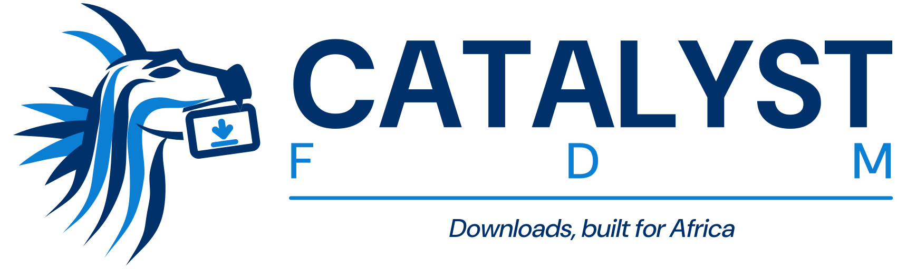

<p align="center"></p>

# CatalystFDM

A **local-first** video and file downloader, built for Africa. Paste a link from YouTube, TikTok, Instagram,
Facebook, X, Vimeo, SoundCloud or 1,800+ other sites — or any direct file link — pick a quality, and it's yours.

**What it does**

- **Spotlight** (`Ctrl/⌘ K`, or just paste a link anywhere in the window): inspects the link, shows every quality with its
  size and how long it will take on *your* connection, and pre-selects a **Smart pick** (1080p, or your preferred quality).
- **Playlists and channels**: one preset for every video, a checklist, and a total-size estimate before you start.
- **Whole series on Muno Watch**: the browser button on an episode page queues this episode, all of them or one of the
  site's ranges, in order, with your own login; episodes you already have are skipped.
- **Library**: Apple TV–style grid with posters (grabbed from the file when a site has none), search, filters and
  **Quick Look** — press Space or click to play right in the app; Open and Show in folder.
- **One-click browser pairing**: install the extension, and CatalystFDM pops up “Brave wants to connect · 4821 ·
  Allow”. Per-browser keys; disconnect any one without touching the others.
- **Fast, resilient engine**: big files download over several connections at once (about 3× faster on the Muno Watch CDN
  in testing), every connection resumes on its own, stalled connections reconnect, temporary site errors retry quietly,
  and downloads interrupted by closing the app carry on when it starts again.
- **Night data** (“Tonight”): wait for the cheap night-bundle window (00:00–06:00 by default, set to your network's),
  pause when it closes, continue the next night.
- **Finishing touches**: embedded title, cover art, chapters and (optional) English subtitles; one-click engine updates;
  plain-language error messages that say what to do.
- Light and dark appearance, notifications when downloads finish, optional “download the link I copied”.

**Under the hood**

- **Go + Fiber + GORM + SQLite** download engine and REST API (**127.0.0.1** only)
- **Tauri + React + TypeScript + Tailwind** desktop UI
- Packaged **`tauri build`** launches the Go API as an **embedded sidecar** (release builds)
- **yt-dlp + ffmpeg** media engine for streaming sites (quality picker, merging, audio extraction) — see `docs/media-engine.md`
- **WebExtension** for Chrome / Brave / Edge / Firefox: a download button on videos, right-click menu, one-click pairing

This repository intentionally avoids features that bypass DRM, paywalls, authentication, anti-bot systems, or protected streaming.
The optional “Use my browser login” setting only reuses *your own* sessions for content your account can already watch.

Brand files (dragon mark, app icon, logos) live in `brand/`; `brand/make_brand.py` rebuilds them from the Duara dragon.

## Prerequisites

| What | Why |
|------|-----|
| **Go 1.22+** | `go-backend` and `npm run build:go-sidecar` |
| **Node.js + npm** | Vite UI and Tauri CLI |
| **Rust + Cargo** | **`tauri dev`**, **`tauri build`**, and matching the sidecar triple to your toolchain |
| **yt-dlp + ffmpeg** (optional) | Streaming-site downloads with quality selection (YouTube, Vimeo, HLS, …). On `PATH`, or set `YTDLP_PATH` / `FFMPEG_PATH`. See `docs/media-engine.md` |

If you see **`failed to get cargo metadata: program not found`**, install Rust: [https://rustup.rs/](https://rustup.rs/).  
Open a **new** terminal after installation so **`cargo`** and **`rustc`** are on `PATH`. On Windows, the default host triple is usually **`x86_64-pc-windows-msvc`**.

You can still run **`npm run dev`** (browser-only UI + manual Go API) **without** Rust.

## Repository layout

- `go-backend/` — API + engine
- `desktop/` — Tauri shell + React UI
- `extension/` — browser extension sources
- `docs/` — architecture + contracts
- `scripts/` — optional root helpers (`.sh`)

## Development (recommended day-to-day)

### 1) Run the Go API yourself

Flexible while you hack on the engine:

```powershell
cd fdm-enorkity/go-backend
Copy-Item .env.example .env   # first time only
go run ./cmd/server
```

### 2) Run only the UI (browser)

```powershell
cd fdm-enorkity/desktop
npm install
npm run dev
```

Open Vite’s URL (http://127.0.0.1:5173). Optional: set `VITE_API_BASE` in `desktop/.env` if the API is not on `http://127.0.0.1:8765`.

### 3) Tauri window in development

Requires **Rust/Cargo on PATH** (see Prerequisites).

```powershell
cd fdm-enorkity/desktop
npm run tauri:dev
```

**Debug behavior:** the desktop shell **does not** auto-start the Go sidecar (`debug_assertions`), so continue running `go run ./cmd/server` in parallel.

- To **test sidecar spawning** from a debug Tauri build:  
  `set FDM_FORCE_SIDECAR=1` (PowerShell: `$env:FDM_FORCE_SIDECAR='1'`) before `npm run tauri:dev` (requires a prior `npm run build:go-sidecar`).

## Production-shaped desktop build (`tauri build`)

1. Produce the Go binary with the Rust host triple name:

   ```powershell
   cd fdm-enorkity/desktop
   npm run build:go-sidecar
   ```

   If `rustc` is not on `PATH`, set `FDM_SIDECAR_HOST_TRIPLE` (e.g. `x86_64-pc-windows-msvc`).

2. Build Tauri:

   ```powershell
   npm run tauri:build
   ```

   For **offline / bundled WebView2** on Windows, use `npm run tauri:build:offline-webview` instead **after** you extract the Microsoft WebView2 **Fixed Runtime** into `desktop/src-tauri/webview2-runtime/` (see that folder’s `README.md`). The default `tauri:build` relies on the normal WebView2 runtime already on the user’s PC.

Release builds **start** `fdm-enorkity-server` on launch (`FDM_EMBEDDED=1`, data under the app **data/config** dirs) and **kill** it on exit. Override with:

- **`FDM_SKIP_SIDECAR=1`** — do not spawn/kill managed sidecar (advanced).

The UI resolves `http://127.0.0.1:<port>` via **`get_api_base_url`** (`backend.json`; default port **8765**). Keep the browser extension popup URL in sync.

> Bundling is on so the sidecar ships with the app. **Installer signing / store “final” packaging is intentionally not in scope yet**—these are smoke-test-ready artifacts.

## Browser extension

- Chrome / Brave / Edge: `chrome://extensions` (or `brave://extensions`) → Developer mode → **Load unpacked** → `extension/chrome`
- Firefox: `about:debugging` → This Firefox → Load Temporary Add-on → `extension/firefox/manifest.json`

Connecting is one click: the extension opens a welcome tab that asks CatalystFDM to connect, the app shows the request with
a 4-digit code, you click **Allow**. Each browser gets its own key (stored as SHA-256); **Browsers** in the app lists them and
can disconnect any one. Details: `docs/security.md` → “One-click pairing”, and `extension/README.md`.

## Documentation

See `docs/architecture.md`, `docs/api.md`, `docs/security.md`, `docs/packaging.md` (sidecar details), and the other topic files.
