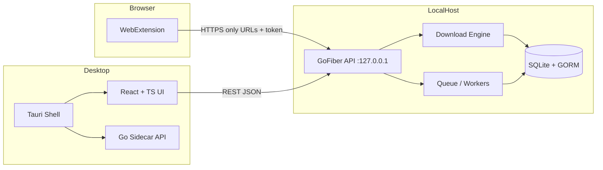

# CatalystFDM — Architecture

## Overview

CatalystFDM is a **local-first** download manager. A Go process owns the download engine, persistence, and a **localhost-only** HTTP API (Fiber). The Tauri desktop shell embeds the React UI and, in packaged builds, **starts the Go server as a sidecar** bound to **127.0.0.1**. Browser extensions talk **only** to `127.0.0.1` with a **pairing token**; they never receive browsing history from the app.

## High-Level Diagram

## Components

| Layer | Responsibility |
|-------|----------------|
| **go-backend** | Downloads, queue, settings, logs, browser auth, URL validation, file I/O |
| **desktop** | UX, pairing UX, spawns/stops Go sidecar (release), reads `backend.json` API port |
| **extension** | User-initiated / detected direct links, context menu, popup status |
| **SQLite** | Downloads, chunks, queue, settings, browser connections, logs |

## Process Model

1. **Development (flexible)** — Run `go-backend` yourself (`go run ./cmd/server`). `tauri dev` **does not** auto-spawn the binary (debug build) so you can iterate on Go and UI separately. Optionally set `FDM_FORCE_SIDECAR=1` to test the packaged sidecar behavior from a debug Tauri build.
2. **Production / `tauri build`** — Tauri embeds `fdm-enorkity-server` as an `externalBin`, sets `FDM_EMBEDDED=1`, passes data paths and `APP_HOST=127.0.0.1`, and kills the child on app exit. React calls `get_api_base_url` so the UI always matches `backend.json`.

## Port configuration

- Default API: **127.0.0.1:8765**.
- On first launch, the shell creates `backend.json` under the OS app **config** directory (Tauri `app_config_dir`), e.g. `%APPDATA%\com.fdm.enorkity\backend.json` on Windows.
- The browser extension **must** point to the same URL (default `http://127.0.0.1:<port>`).

## Modularity

- `internal/config` — env + bootstrap paths  
- `internal/database` — GORM, migrations hook  
- `internal/models` — entities  
- `internal/security` — URL allowlists, filename sanitization, token verify  
- `internal/downloads` — HTTP client, `.part` files, Range/resume  
- `internal/queue` — concurrency, priority, ordering  
- `internal/browser` — pairing, connection registry  
- `internal/api` — Fiber routes, DTOs, consistent JSON envelope  

## Legal & Security Posture

- No DRM bypass, no stream ripping, no paywall/auth bypass.  
- Extension surfaces **direct file URLs** and **explicit user actions** only.  
- Optional setting: block private-network / localhost targets unless enabled.  
- Embedded mode (`FDM_EMBEDDED=1`) relaxes CORS only for **Tauri / local webview** origins (never the public Internet).

## Evolution

- Phase 4+: multi-chunk parallel workers, merge, advanced bandwidth shaping.  
- Packaging: code signing, store listings, and polished installers (current bundles are functional but not “store final”).

## Direct-file engine (CatalystFDM 0.3)

- **Multi-connection** (`internal/downloads/segmented.go`): when HEAD reports `Accept-Ranges: bytes` and the file is
  ≥ 8 MB, it is split into up to `connections_per_download` (default 4, max 16) byte ranges fetched in parallel over
  separate HTTP/1.1 connections and written in place with `WriteAt`. Progress per range lives in `download_chunks`, so
  pause/resume and app restarts continue every range. A server that answers a range request with 200 drops back to one
  stream; a connection silent for 30 s is cut and retried (5 attempts with back-off).
- **Restart recovery**: `Manager.RecoverInterrupted()` at startup re-queues downloads left `active` by a crash or quit.
- **Night scheduler**: `Manager.RunNightScheduler()` (see `docs/media-engine.md` → Night data).
